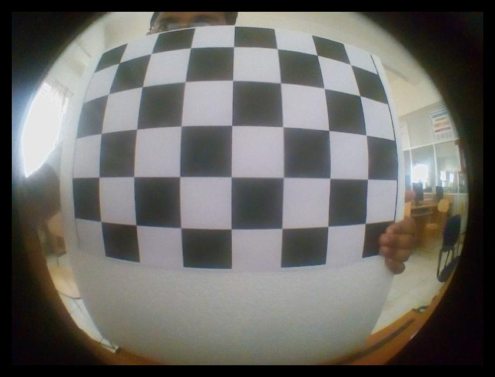
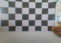
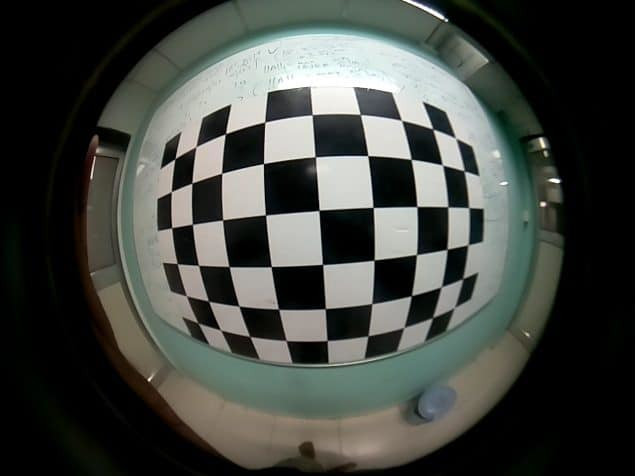
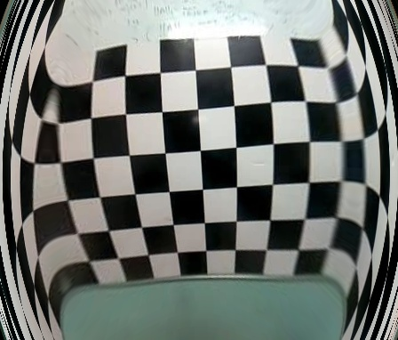
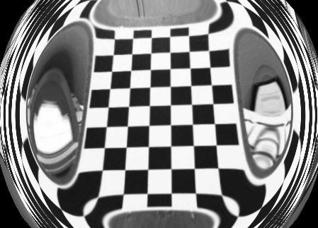
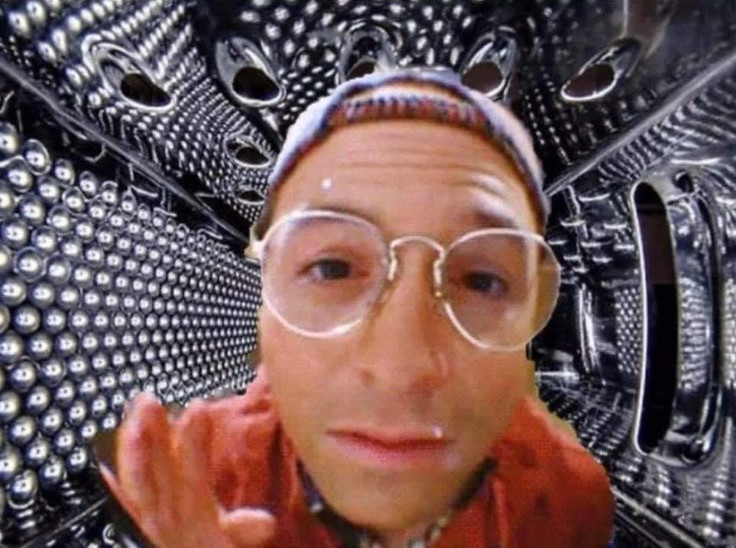
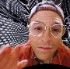

# Trabalho 2 de Visão Computacional

## Executando o trabalho

Basta entrar no diretório do projeto e rodar o comando:

```bash
source run.sh
```

E o script python percorrerá o diretório `imagens/input`, econtrará as matrizes
das câmeras das imagens e gerará duas imagens como output: uma com os cantos do
tabuleiro marcados e outra com a imagem com sua distorção "corrigida".

## Organização do diretório

O diretório `imagens/` contém todas as imagens usadas no projeto. Como demorei
para fazer o trabalho nenhuma delas foi tirada por mim, todas foram encontradas
pela internet.

O diretório `imagens/input/` tem as imagens que servem de entrada para o programa,
com o padrão de nome "AxB.jpg" onde A e B são os números de pontos internos do
tabuleiro de xadrez para calibração da câmera, de acordo com o tutorial passado
na descrição do trabalho.

Já em `imagens/output/` estão as imagens geradas após o processamento.

## Resultados obtidos

Foram utilizados três imagens, cada uma observada abaixo:

### 5x7.jpg

Essa é uma imagem extremamente distorcida, mais do que uma câmera web de baixa
qualidade, mas serve bem para esse exemplo.

- Entrada:


- Saída:


O resultado obtido era o esperado, o algoritmo pegou bem os cantos do tabuleiro
e o ajeitou de acordo. É inclusive bem visível a redução das dimensões da imagem,
o que faz sentido já que a informação do tabuleiro foi "comprimida".

### 6x9.jpg

Essa é uma imagem bem similar à anterior, mas com uma distorção ainda maior.

- Entrada:


- Saída:


Por algum motivo desconhecido, mesmo repetidos experimentos, a imagem após o
processamento para retirar a distorção da imagem fazia um bom trabalho no meio
da imagem mas distorcia extremamente os cantos.

### 7x6.jpg

Essa é particularmente interessante pois estava no tutorial de calibração de
câmera do OpenCV, mas com a distorção já removida!

- Entrada:


- Saída:


Após "arrumar" a distorção da imagem, por mais que o meio aparentemente não
tenha mudado as laterais da imagens acabaram ficando distorcidas assim como
as da imagem `6x7.jpg`, o que era completamente inesperado, visto que essa
imagem aparentemente já estava arrumada, mas por mais que se alterassem os
testes o resultado obtido era sempre o mesmo.

## Conclusões

A parte relevante dos exeperimentos foi a obtenção das matrizes das câmeras,
que por si só não são muito úteis, mas possibilitam outras coisas como ajustar
a distorção de duas imagens diferentes de um mesmo lugar para poder uní-las,
dentre outros experimentos como remoção de distorções de outras fotos que não
sejam de tabuleiros.


## Um teste

Tem uma imagem que tentei ajustar utilizando a matriz da imagem `6x9.jpg`,
que julguei similar o suficiente, o resultado foi o seguinte:

- Entrada:


- Saída:


Realmente parte da distorção se foi, então "no olhômetro" mesmo não sabendo
a matriz exata de uma câmera podemos dar um jeito de reduzir distorções.

Só achei curioso mesmo, não esperava funcionar tão bem, dado que outros
experimentos deram **bem** errado.
